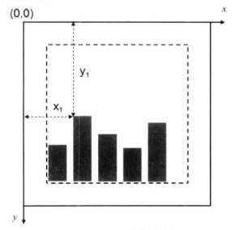
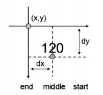

### svg 

使用XML格式来定义图形

 * svg绘制的是矢量图
 * 基于xml，可为每个元素添加JS事件处理器
 * 每个图形均视为对象，改变对象的属性，图形会跟着变
 * 不适合游戏应用

### canvas 
是通过js来绘制2d图形

 * 绘制的是位图，放大后失真
 * 不支持时间处理器
 * 能以.png或.jpg格式保存图像
 * 适合游戏应用

### 选择器
d3.select()

d3.selectAll()

classed()

append()

insert()

remove()

###数据绑定
datum() --- 将数据绑定到选择集上

data() --- 将数组各项分别绑定到选择集的各元素上

选择一个空集，然后使用enter().append()的形式来添加足够数量的元素
```
d3.select('body')
	.selectAll('div')
	.data(dataset)
    .enter()
    .append('div')
```

### 绘制柱状图




### 比例尺
将某一区域的值映射到另一区域，其大小关系不变

 * 在数学中，x的范围被称为定义域，y的范围被称为值域
 * D3中的定义域为domain，值域为range
 
线性比例尺：linear()  能将一个连续的区间，映射到另一区间。要解决柱形图宽度的问题，就需要线性比例尺。

线性比例尺 linear() 

linear().rangeRound()


 d3.scale.linear()的返回值，是可以当函数来使用的。


序数比例尺：定义域和值域不一定是连续的

序数比例尺 ordinal()

### 坐标轴

d3.svg.axis()  创建一个默认的新坐标轴

axis.scale()  设置坐标轴的比例尺

axis.orient() 设置坐标轴方向， top、bottom、left、right

axis.ticks()  设置坐标轴的分隔数

### 动态效果
transition()  启动过渡效果

duration()  指定过度的持续时间

ease()  指定过度的方式

* linear  
* circle
* elastic
* bounce

delay()  指定延迟的时间
	

